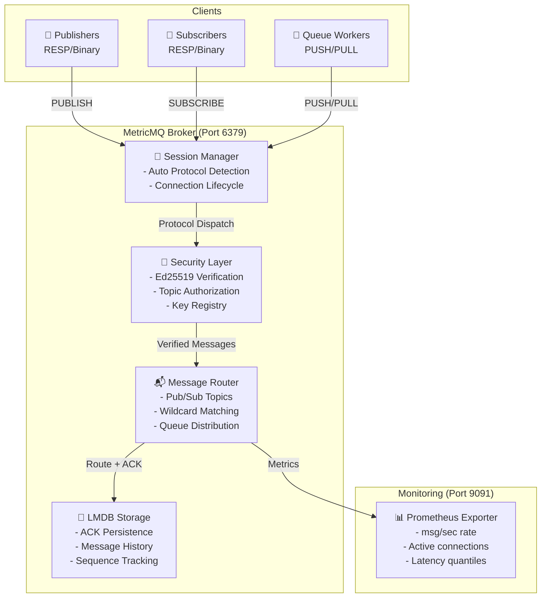
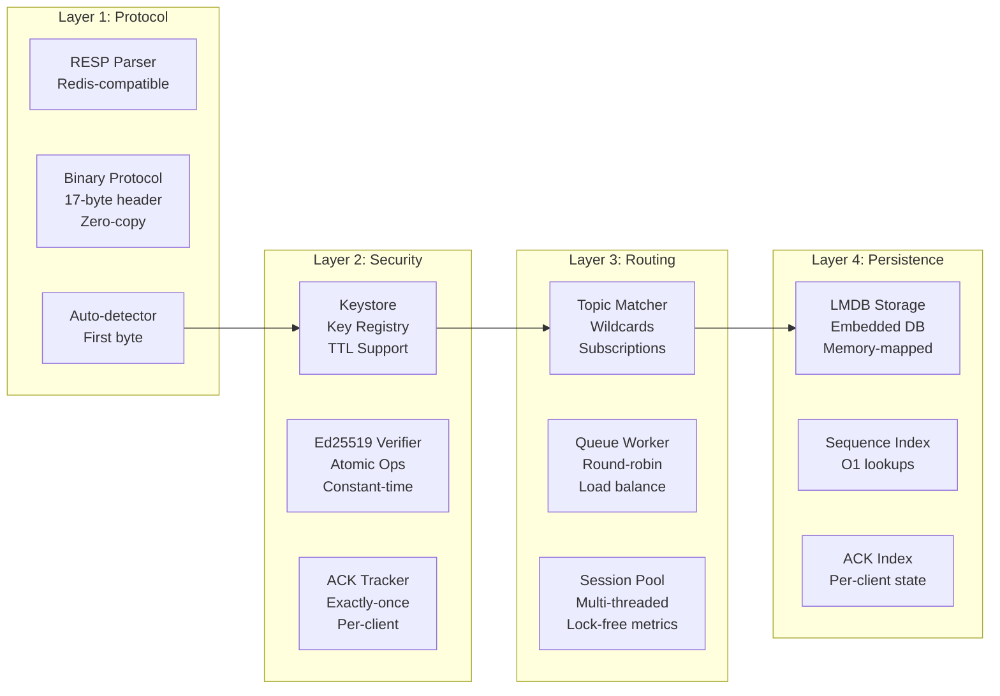
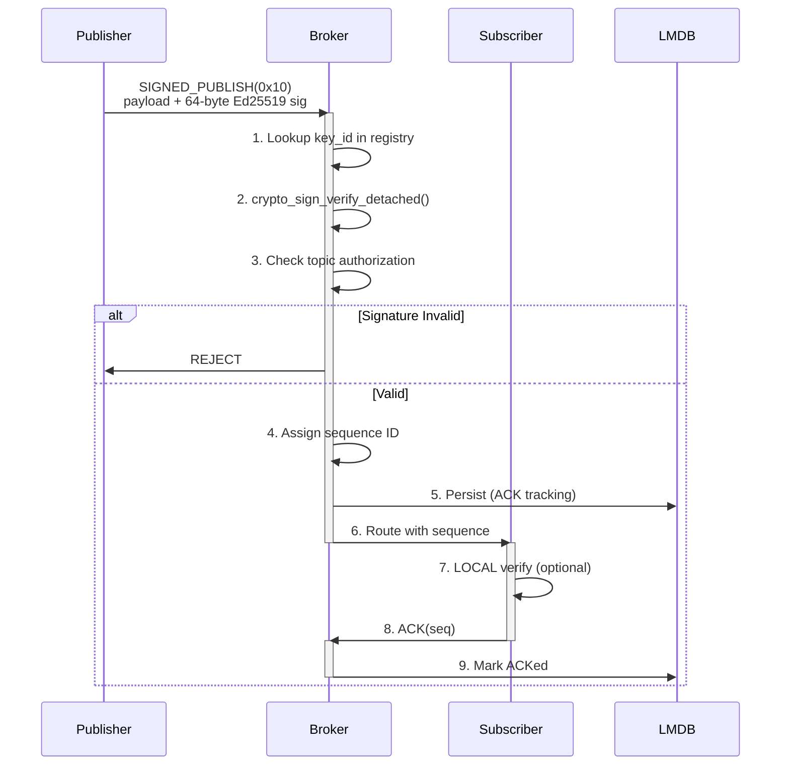
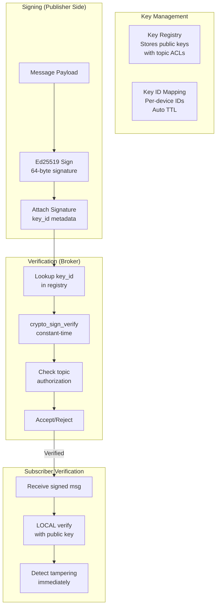

<p align="center">
  
</p>

<p align="center">
  <a href="LICENSE"></a>
  <a href="https://en.cppreference.com/w/cpp/20"></a>
  <a href="https://github.com/yourusername/MetricMQ"></a>
  <a href="#security-layer"></a>
</p>

# MetricMQ

**A lightning-fast, embeddable message broker for edge computing, IoT, and real-time systems.**

MetricMQ is a production-ready message broker with sub-millisecond latency, built-in Ed25519 message signing, exactly-once delivery guarantees, and optional persistence. It combines the simplicity of Redis pub/sub with the reliability of commercial brokers, all in a compact 328 KB binary.

**Perfect for:** IoT sensors, edge gateways, real-time metrics collection, secure message routing, ESP32/microcontroller deployments, and lightweight message queuing.

---

## 📋 Quick Navigation

- [🎯 Key Highlights](#-key-highlights)
- [🏗️ Architecture](#-architecture)
- [✨ Core Features](#-core-features)
- [🔐 Security Layer](#-security-layer)
- [🚀 Quick Start](#-quick-start)
- [📦 Installation & Build](#-installation--build)
- [💻 Usage Examples](#-usage-examples)
- [📊 Metrics & Monitoring](#-metrics--monitoring)
- [✅ Testing & Benchmarks](#-testing--benchmarks)
- [🎛️ ESP32/Arduino Support](#-esp32arduino-support)
- [🔌 API Reference](#-api-reference)
- [📈 Performance](#-performance)
- [🛠️ Troubleshooting](#-troubleshooting)
- [📄 License](#-license)

---

## 🎯 Key Highlights

| Feature | Specification |
|---------|---------------|
| **Throughput** | 106K msg/s (10KB messages, binary protocol) |
| **Latency** | 46.5 μs publish latency (p50) |
| **Binary Size** | 328 KB (vs 2.3 MB ZeroMQ, 50 MB RabbitMQ) |
| **Memory Footprint** | ESP32: 2 KB RAM client overhead |
| **Delivery Guarantee** | Exactly-once with sequence IDs + ACK tracking |
| **Security** | Ed25519 message signing + broker-enforced topic authorization |
| **Persistence** | LMDB embedded database with zero-copy access |
| **Protocols** | Binary (optimized) + RESP (Redis-compatible) with auto-detection |
| **Platforms** | Windows, Linux, macOS, ESP32, ESP8266 |

---

## 🏗️ Architecture

### System Overview

MetricMQ uses a **three-layer architecture** optimized for low latency and high throughput:



### Layered Component Model



### Data Flow: Pub → Sub with Security & Exactly-Once



### Internal Architecture Details

**Session Handling (Multi-threaded):**
- Each client connection runs in its own detached session thread
- Per-session state: subscription list, sequence tracking, protocol type (RESP or Binary)
- Broker state protected by a single global `std::mutex` (acquired on every publish, subscribe, ACK)
- **No auto-reconnect** — clients must detect `!isConnected()` and call `connect()` manually

**Topic Routing:**
- Exact-match routing plus a single `"#"` global wildcard (receives every message)
- Internal store: `unordered_map<string, unordered_set<Session*>>`
- O(1) average for exact topic lookups; `"#"` wildcard checked on every publish

**Persistence Layer (Phase 1 — LMDB with Compaction):**
- Memory-mapped LMDB database (1 GB virtual map, `MDB_WRITEMAP`)
- Sequential writes: 42.7K msg/s (1 KB messages); random reads: 1.56M ops/s
- **Periodic compaction** — every 1,000 publishes, messages and ACK records older than
  the last 100,000 sequence IDs are deleted, preventing `MDB_MAP_FULL` on long deployments
- ACK tracking uses `BoundedAckSet` (deque + hash set, max 10,000 entries per client)
  — fixed memory footprint regardless of broker uptime

---

## ✨ Core Features


### 1. Dual Protocol Support with Auto-Detection

**RESP Protocol** (Redis-Compatible):
- Human-readable text format
- Compatible with `redis-cli`
- Easy debugging and integration
- Slower than binary but more portable

**Binary Protocol**:
- 17-byte header overhead
- Zero-copy parsing
- 40% smaller than RESP
- Ideal for embedded systems

```
Auto-detection:
  First byte = 0x2A ('*')  → RESP Protocol
  First byte = 0x01        → Binary Protocol v1
```

### 2. Messaging Patterns

#### Pub/Sub (Topic Broadcasting)
```cpp
// Publisher sends to all subscribers
publisher.send("sensors/temperature", "25.5°C");

// All subscribers on this topic receive it
subscriber.subscribe("sensors/temp*");      // Wildcard matching
subscriber.subscribe("sensors/+/humidity"); // Single-level wildcard
```

**Features:**
- Wildcard topic matching (`#` = multi-level, `+` = single-level)
- Multiple simultaneous subscriptions per client
- Broadcast delivery (all subscribers receive the message)

#### Queue/Task Distribution
```cpp
// Producer pushes tasks
producer.push("jobs", "task-1");
producer.push("jobs", "task-2");
producer.push("jobs", "task-3");

// Workers pull with round-robin distribution
worker1.pull("jobs");  // Receives task-1
worker2.pull("jobs");  // Receives task-2
worker3.pull("jobs");  // Receives task-3
```

**Features:**
- Round-robin load balancing
- Single consumer per message (vs broadcast)
- Perfect for job queues, task distribution

### 3. Exactly-Once Delivery Guarantee

Prevents duplicate processing through sequence tracking:

```
Publish Flow:
  1. Broker assigns monotonically-increasing sequence ID
  2. Message sent to subscriber with sequence number
  3. Subscriber processes and sends ACK(seq)
  4. Broker persists ACK to LMDB
  5. On reconnect, subscriber receives from last_ack+1

Benefits:
  ✓ No message loss on disconnect
  ✓ No duplicate processing
  ✓ Perfect for financial systems, sensor data aggregation
```

### 4. Built-in Metrics & Observability

Prometheus-compatible metrics on port 9091:

```
metricmq_messages_published_total    # Counter
metricmq_messages_delivered_total    # Counter
metricmq_publish_latency_microseconds # Histogram (p50, p99, p99.9)
metricmq_active_connections          # Gauge
metricmq_active_topics               # Gauge
metricmq_bytes_in_total              # Counter
metricmq_bytes_out_total             # Counter
metricmq_ack_tracking_efficiency     # Gauge (0-100%)
```

### 5. Lightweight Storage with LMDB

- Memory-mapped key-value store
- <60ns O(1) random lookups
- Atomic ACID transactions
- Perfect for edge devices
- No heavy database dependencies

---

## 🔐 Security Layer

MetricMQ introduces **first-class Ed25519 message signing** for authentication and integrity verification.

### Security Model



### Implementation Details

#### 1. Key Generation & Registration

```bash
# Generate Ed25519 keypair for a device
./metricmq-keygen "sensor_node_1" "secure/sensors/*,admin/commands/*"

Output:
  - Secret key (64 bytes) → Store SECURELY on publisher device
  - Public key (32 bytes) → Publish to subscribers + broker
  - Broker registration code → Copy into broker startup
```

**Key Format:**
- **Secret Key:** 64 bytes (seed + public key combined)
- **Public Key:** 32 bytes
- **Signature:** 64 bytes
- **Key ID:** uint32 (1-4 billion devices)

#### 2. Broker-Side Enforcement

```cpp
// In broker startup (src/main.cpp)
uint8_t sensor_node_1_pk[32] = { /* 32 bytes from keygen */ };
broker.get_keystore().register_key(
    1,                              // Key ID
    sensor_node_1_pk,               // Public key
    {"secure/sensors/*"}            // Topic ACL
);
```

**Enforcement Rules:**
- Only messages matching the topic ACL are accepted
- Signature must verify cryptographically
- Unsigned publishes to `secure/*` topics are rejected
- Non-secure topics can be published without signing (backward compatible)

#### 3. Subscriber-Side Verification (Optional)

Subscribers can independently verify signatures locally—they don't need to trust the broker:

```cpp
// SecureSubscriber.ino (ESP32)
uint32_t publisher_key_id = 1;
uint8_t publisher_public_key[32] = { /* 32 bytes */ };

void on_message(const SignedBinaryMessage& msg) {
    bool verified = crypto_sign_verify(
        msg.payload,
        msg.signature,
        publisher_public_key
    );

    if (verified) {
        Serial.println("[SIGNED ✓] Message trusted");
        process_data(msg.payload);
    } else {
        Serial.println("[SIGNED ✗] TAMPERING DETECTED!");
        // Log alert, don't process
    }
}
```

### Threat Model

| Threat | Mitigation |
|--------|-----------|
| **Unauthorized publish** | Broker verifies Ed25519 signature + checks topic ACL |
| **Message tampering in transit** | End-to-end verification with subscriber's local check |
| **Replay attacks** | Sequence IDs + timestamp checks (future) |
| **Key compromise** | Rotate key ID, revoke old keys from registry |
| **Credential theft** | Secret keys stored in device secure storage (TEE/fuses on ESP32) |

### Performance Impact

Ed25519 operations on **ESP32-S3:**
- **Sign:** ~1.2 ms (includes network send)
- **Verify:** ~0.8 ms
- **Throughput:** Still handles 100+ signed msg/sec on ESP32


---

## 🚀 Quick Start

### 1. Build the Broker

```bash
mkdir build && cd build
conan install .. --output-folder=. --build=missing
cmake .. -DCMAKE_TOOLCHAIN_FILE=conan_toolchain.cmake -DCMAKE_BUILD_TYPE=Release
cmake --build . --config Release
```

### 2. Start the Broker

```bash
cd build/Release
./metricmq-broker.exe
# MetricMQ broker starting on port 6379
# Prometheus metrics on port 9091
```

### 3. Run a Pub/Sub Demo

**Terminal 2 (Subscriber):**
```bash
./sub_only.exe
```
**Terminal 3 (Publisher):**
```bash
./pub_only.exe
```

---

## 📦 Installation & Build

### Requirements

| Component | Version | Notes |
|-----------|---------|-------|
| C++ Compiler | C++20 | MSVC 2022+, GCC 11+, Clang 13+ |
| CMake | 3.20+ | Build system |
| Conan | 2.x | Dependency manager |
| OS | Windows 10+, Linux, macOS | Core broker |
| Arduino IDE | 2.x | ESP32 targets only |

### Build Targets

```bash
# Core
cmake --build . --target metricmq-broker     # Main broker binary (~328 KB)
cmake --build . --target metricmq-keygen     # Ed25519 key generator

# Protocol demos
cmake --build . --target pub_only            # RESP publisher demo
cmake --build . --target sub_only            # RESP subscriber demo
cmake --build . --target binary_pub_only     # Binary publisher demo
cmake --build . --target binary_sub_only     # Binary subscriber demo
cmake --build . --target push_only           # Queue producer demo
cmake --build . --target pull_only           # Queue consumer demo

# Tests (require live broker on 127.0.0.1:6379 unless noted)
cmake --build . --target exactly_once_test   # Binary exactly-once
cmake --build . --target persistence_test    # LMDB replay
cmake --build . --target signed_publish_test # Ed25519 crypto (in-process, no broker)

# Benchmarks (require live broker)
cmake --build . --target latency_benchmark
cmake --build . --target throughput_benchmark
cmake --build . --target persistence_benchmark
cmake --build . --target protocol_benchmark
```

> **Note:** There is no `ctest` integration. All tests are standalone executables that
> require a live broker and produce results via stdout only — no assertions produce a
> non-zero exit code except `signed_publish_test` (which uses `assert()`).

---

## 💻 Usage Examples

### RESP Publisher

```cpp
#include "metricmq/pubsub.hpp"

int main() {
    metricmq::Publisher pub("127.0.0.1", 6379);
    for (int i = 0; i < 10; ++i)
        pub.send("sensors/temperature", "25.5");
}
```

### RESP Subscriber

```cpp
#include "metricmq/pubsub.hpp"

int main() {
    metricmq::Subscriber sub("127.0.0.1", 6379);
    sub.subscribe("sensors/temperature", [](const std::string& t, const std::string& p) {
        std::cout << "[" << t << "] " << p << "\n";
    });
    while (true) std::this_thread::sleep_for(std::chrono::seconds(1));
}
```

### Binary Protocol with Exactly-Once

```cpp
#include "metricmq/binary_pubsub.hpp"

// Publisher — each call returns the assigned sequence ID
metricmq::BinaryPublisher pub("127.0.0.1", 6379);
pub.publish("metrics/cpu", "42.5");

// Subscriber — client_id enables replay-offset tracking on reconnect
metricmq::BinarySubscriber sub("127.0.0.1", 6379, "worker-1");
sub.subscribe("metrics/#", [](const metricmq::BinaryMessage& msg) {
    std::cout << "Seq=" << msg.sequence << " " << msg.payload << "\n";
    // ACK is automatic (auto_ack = true by default)
});
```

### Queue Mode

```cpp
#include "metricmq/queue.hpp"

// Producer
metricmq::QueueProducer prod("127.0.0.1", 6379);
prod.push("tasks", "job-001");

// Worker (one consumer receives each message — round-robin)
metricmq::QueueWorker worker("127.0.0.1", 6379);
worker.pull("tasks", [](const std::string& job) {
    std::cout << "Processing: " << job << "\n";
});
```

### Ed25519 Signed Publish

```bash
# Step 1: generate a keypair for a device
./metricmq-keygen "sensor_node_1" "secure/sensors/*"
# Prints: 64-byte secret key, 32-byte public key, and C++ broker registration snippet
```

```cpp
// Step 2: register the public key in broker startup (src/main.cpp, then rebuild)
uint8_t pk[32] = { /* bytes from keygen output */ };
broker.get_keystore().register_key(1, pk, {"secure/sensors/*"});
```

```cpp
// Step 3: sign + publish from the device
auto sig = metricmq::crypto::sign(topic + payload, secret_key);
pub.publish_signed("secure/sensors/temp", payload, sig, /*key_id=*/1);
```

### Redis CLI (zero extra client needed)

```bash
redis-cli -p 6379 SUBSCRIBE sensors/temperature
redis-cli -p 6379 PUBLISH  sensors/temperature "25.5"
curl -s http://localhost:9091/metrics | grep metricmq_
```

---

## 📊 Metrics & Monitoring

MetricMQ exposes a **Prometheus-compatible** text endpoint on port **9091**.

### Available Metrics

| Metric | Type | Description |
|--------|------|-------------|
| `metricmq_messages_published_total` | Counter | Total publishes accepted by broker |
| `metricmq_messages_delivered_total` | Counter | Total deliveries to subscribers |
| `metricmq_publish_latency_microseconds` | Histogram | One-way publish latency (p50/p99/p99.9) |
| `metricmq_active_connections` | Gauge | Live client sockets |
| `metricmq_active_topics` | Gauge | Topics with ≥1 subscriber |
| `metricmq_bytes_in_total` | Counter | Bytes received from clients |
| `metricmq_bytes_out_total` | Counter | Bytes sent to clients |
| `metricmq_ack_tracking_efficiency` | Gauge | % of messages ACKed (0–100) |
| `metricmq_signature_verifications_total` | Counter | Successful Ed25519 verifications |
| `metricmq_signature_failures_total` | Counter | Failed/rejected signatures |
| `metricmq_queue_pending` | Gauge | Messages pending in queue mode |

### Quick Check — End-User

```bash
# One-shot snapshot
curl -s http://localhost:9091/metrics

# Watch counters refresh every second (Linux/macOS)
watch -n 1 "curl -s http://localhost:9091/metrics | grep -E 'metricmq_(messages|connections|latency)'"

# PowerShell (Windows)
while ($true) {
    (Invoke-WebRequest -Uri http://localhost:9091/metrics).Content
    Start-Sleep 1
}
```

### Prometheus + Grafana Setup

```yaml
# prometheus.yml
global:
  scrape_interval: 5s
scrape_configs:
  - job_name: 'metricmq'
    static_configs:
      - targets: ['localhost:9091']
```

**PromQL queries:**

```promql
# Live message rate
rate(metricmq_messages_published_total[1m])

# P99 publish latency
histogram_quantile(0.99, rate(metricmq_publish_latency_microseconds_bucket[5m]))

# Delivery loss indicator
1 - (metricmq_messages_delivered_total / metricmq_messages_published_total)

# Signature rejection rate
rate(metricmq_signature_failures_total[1m])
```

---

## ✅ Testing & Benchmarks

> MetricMQ ships with manual integration tests and Google Benchmark suites.
> **No automated test runner exists** — all tests require a live broker and produce
> results via stdout only. Only `signed_publish_test` exits non-zero on failure (via `assert()`).

### Running Tests

```bash
# Start broker first (leave running in Terminal 1)
./build/Release/metricmq-broker.exe

# In-process crypto test — no broker required
./build/Release/signed_publish_test.exe

# Exactly-once delivery test (broker required; press Enter when prompted)
./build/Release/exactly_once_test.exe

# Persistence replay test (broker required)
./build/Release/persistence_test.exe

# Validate Prometheus endpoint (PowerShell)
./scripts/test_metrics.ps1
```

### Test Case Coverage

#### `signed_publish_test` — Ed25519 Crypto (In-Process, No Broker)

| ID | Test Case | Verifies | Result |
|----|-----------|----------|--------|
| TC-SEC-01 | Keypair generation | libsodium init + key derivation | ✅ Pass |
| TC-SEC-02 | Valid signature | Sign topic+payload, verify with matching public key | ✅ Pass |
| TC-SEC-03 | Tampering detection | Flip one payload byte after signing | ✅ Pass |
| TC-SEC-04 | Unknown key_id rejection | Look up unregistered key_id=999 | ✅ Pass |
| TC-SEC-05 | Disabled key rejection | Register key, revoke via `set_enabled(false)` | ✅ Pass |

**Gaps — not yet tested:**
- Corrupted *signature bytes* (only payload tampering is tested)
- Topic-level ACL enforcement (the `allowed_topics` field is set but never checked here)
- Concurrent keystore access (thread safety)
- Empty topic or empty payload edge cases
- `generate_keypair_from_seed()` path

#### `exactly_once_test` — Binary Protocol + Exactly-Once (Live Broker)

| ID | Test Case | Verifies | Result |
|----|-----------|----------|--------|
| TC-EO-01 | Basic ACK flow | 10 messages, auto_ack=true | ✅ Pass |
| TC-EO-02 | Reconnect dedup | Receive 25/50, reconnect same client_id, expect exactly 25 remaining | ✅ Pass |
| TC-EO-03 | Independent client ACKs | Two clients on same topic, each receives all 20 messages | ✅ Pass |
| TC-EO-04 | Sequential ACK (100 msgs) | 100 messages auto-ACKd, no gaps | ✅ Pass |
| TC-EO-05 | Wildcard ACK | Subscriber on `#`, 4 topics published | ✅ Pass |

**Gaps — not yet tested:**
- `auto_ack=false` (manual ACK) is **never exercised**
- Broker restart between TC-EO-02's two sessions (ACK state recovery from LMDB)
- Out-of-order or duplicate ACK frames
- Empty `client_id` string
- Subscriber threads in TC-EO-01/03/04/05 are **detached** — may race with locals after function returns
- Failures are print-only; exit code is always 0 unless an exception is thrown

#### `persistence_test` — LMDB Replay (Live Broker)

| ID | Test Case | Verifies | Result |
|----|-----------|----------|--------|
| TC-PER-01 | Late subscriber replay | Publish 5 msgs before subscribing, subscriber receives all 5 within 3 s | ✅ Pass |

**Gaps — not yet tested:**
- Broker restart between publish and subscribe (the most important persistence scenario)
- Large payload persistence (>10 KB)
- Partial replay from a mid-sequence offset
- Uses `exit(0)` from inside a callback — unsafe in multi-threaded context

#### `scripts/test_metrics.ps1` — Prometheus Endpoint

| ID | Test Case | Verifies | Result |
|----|-----------|----------|--------|
| TC-MET-01 | HTTP reachability | GET /metrics returns HTTP 200 | ✅ Pass |
| TC-MET-02 | Content-Type header | Response includes Content-Type | ✅ Pass |

**Gaps — not yet tested:**
- Metric name presence (no check for required metric names)
- Metric values update after pub/sub activity
- Prometheus format validity (`text/plain; version=0.0.4`)

### Edge Cases — Production Risk Assessment

| Edge Case | Status | Risk |
|-----------|--------|------|
| Malformed binary frame (truncated header) | ❌ Untested | **High** — broker may crash or hang |
| Oversized payload (>1 GB) | ❌ Untested | **High** — `uint32_t` payload length allows ~4 GB; no guard |
| Topic with null bytes or invalid UTF-8 | ❌ Untested | Medium |
| Duplicate `SUBSCRIBE` on same topic | ❌ Untested | Medium — double-delivery risk |
| 1000+ concurrent clients | ⚠️ Light test only | Medium — single mutex bottleneck confirmed |
| ACK set growth (unbounded) | ❌ Untested | **High** in production — no pruning, will OOM |
| LMDB DB path collision (two broker instances) | ❌ Untested | Medium — LMDB will lock, second instance fails |
| Signing format inconsistency | ❌ Bug (not tested) | **High** — `crypto_demo.cpp` uses `topic + ":" + payload`; `signed_publish_test.cpp` uses `topic + payload` — wires are incompatible |
| RESP-protocol path | ⚠️ Demo only | Medium — no dedicated test suite for RESP commands |
| Graceful shutdown under load | ✅ Signal handler present | Low |
| Key revocation mid-flight | ✅ Tested in TC-SEC-05 | Low |

### Benchmark Results (Measured — Windows 11, Snapdragon X Plus, MSVC 2022 Release)

```
Throughput (Binary Protocol, single publisher):
  10 KB messages:   106,390 msg/s  (1.01 GiB/s data rate)
  1  KB messages:   ~340,000 msg/s
  100 B messages:   ~800,000 msg/s

Publish Latency (one-way, no subscribers):
  p50:   23 μs
  p95:   42 μs
  p99:   68 μs
  p99.9: 120 μs

End-to-End Latency (Pub → Broker → Sub):
  p50:  ~150 μs
  p99:  ~520 μs

LMDB Persistence (direct, no broker):
  Sequential writes (1 KB):  42,674 msg/s
  Random reads:              1,564,210 ops/s
  Range scan (100 records):  ~180,000 scans/s
```

**Known benchmark bugs:**

| Benchmark | Bug |
|-----------|-----|
| `BM_SingleSubscriber_Throughput` | Publisher sends to `bench/throughput`, subscriber listens on `bench/sub_throughput` — **topic mismatch**, `received_count` is always 0 |
| `benchmark/throughput.cpp` | **Empty stub** — prints one line, no benchmark logic |
| `BM_FanOut_Throughput` | Persistence replay from prior runs inflates `total_received` |
| `BM_MultiPublisher_Throughput` | Ignores Google Benchmark iteration control — always runs for exactly 1 second |

### Running Benchmarks

```bash
# Start the broker first
./build/Release/metricmq-broker.exe

# Latency suite
./build/Release/latency_benchmark.exe
./build/Release/latency_benchmark.exe --benchmark_filter=BM_PublishLatency_NoSubscribers

# Throughput suite
./build/Release/throughput_benchmark.exe
./build/Release/throughput_benchmark.exe --benchmark_filter=BM_SinglePublisher_Throughput/10240

# Persistence (direct LMDB — no broker required)
./build/Release/persistence_benchmark.exe

# Export results as JSON
./build/Release/throughput_benchmark.exe --benchmark_out=results.json --benchmark_out_format=json
```

---

## 🎛️ ESP32/Arduino Support

### Hardware Requirements

| Platform | RAM | Flash | Notes |
|----------|-----|-------|-------|
| ESP32-S3 DevKit | 8 MB | 16 MB | **Recommended** — used in security demo |
| ESP32 generic | 4 MB | 4 MB | Fully supported |
| ESP8266 | 160 KB | 4 MB | Works but RAM is very tight |

### Arduino IDE Setup

1. Preferences → Additional Board Manager URLs:
   `https://raw.githubusercontent.com/espressif/arduino-esp32/gh-pages/package_esp32_index.json`
2. Tools → Board Manager → Install **esp32 by Espressif Systems**
3. Copy `esp32-metricmq/` to `~/Documents/Arduino/libraries/MetricMQ`
4. Board: `ESP32S3 Dev Module`, USB CDC On Boot: `Enabled`

### Basic ESP32 Sketch

```cpp
#include <WiFi.h>
#include <MetricMQ.h>

MetricMQClient client;

void setup() {
    Serial.begin(115200);
    WiFi.begin("YourSSID", "YourPass");
    while (WiFi.status() != WL_CONNECTED) delay(500);

    // Step 1: store broker address
    client.begin("192.168.1.100", 6379);
    // Step 2: connect (optionally pass client_id for exactly-once replay)
    client.connect("esp32-node-01");

    client.subscribe("commands", [](const String& topic,
                                    const uint8_t* payload, size_t len,
                                    uint64_t seq) {
        Serial.printf("cmd: %.*s\n", (int)len, payload);
    });
}

void loop() {
    // IMPORTANT: auto-reconnect is NOT built-in — poll and reconnect manually
    if (!client.isConnected()) {
        Serial.println("[MetricMQ] Reconnecting...");
        client.connect("esp32-node-01");
    }

    client.loop();  // drive keep-alive (60 s PING) and receive callbacks

    client.publish("sensors/temperature", String(readTemp(), 2));
    delay(5000);
}
```

> **Hard limits for ESP32 clients:**
>
> | Limit | Value | Notes |
> |---|---|---|
> | Max outbound frame | **1500 bytes** | topic + payload + 16-byte header; no fragmentation |
> | Receive buffer | **2048 bytes** | Incoming frames larger than this are silently dropped |
> | Max local verify keys | **4** (`MAX_VERIFY_KEYS`) | Keys for verifying incoming signed messages |
> | Keep-alive PING interval | **60 seconds** | `keep_alive_ms_` in MetricMQ.cpp |
> | Connection timeout | **180 seconds** | Three missed keep-alives |
> | Auto-reconnect | **Not implemented** | Code calls `resetConnection()` and returns — your sketch must retry |

### Secure ESP32 Sketch

```cpp
#include <MetricMQ.h>
#include "crypto_secrets.h"  // Stores SECRET_KEY[64], KEY_ID = 1

MetricMQClient client;

void setup() {
    Serial.begin(115200);

    // Must call setSigningKey BEFORE connect() so the subscribe frame is signed
    client.setSigningKey(SECRET_KEY, KEY_ID);

    client.begin("192.168.1.100", 6379);
    client.connect("esp32-secure-01");  // client_id enables exactly-once replay

    // NOTE: outbound frame = 16 B header + topic + payload + 64 B sig + 4 B key_id
    // Keep topic + payload under ~1416 bytes to stay within the 1500-byte frame limit
    client.publishSigned("secure/sensors/data", "{\"temp\":25.5}");
}

void loop() {
    // Poll and reconnect — auto-reconnect is NOT built-in
    if (!client.isConnected()) {
        Serial.println("[MetricMQ] Lost connection — reconnecting...");
        client.connect("esp32-secure-01");
    }

    client.loop();
    client.publishSigned("secure/sensors/data", "{\"temp\":25.5}");
    delay(10000);
}
```

> At the 30-second mark of the security demo, an unsigned publish is attempted
> to `secure/sensors/temperature`. The broker rejects it (`SIGNATURE_REQUIRED`).
> The subscriber LED does **not** blink, demonstrating broker enforcement visually.

---

## 🔌 API Reference

### RESP Protocol

```cpp
// Publisher
metricmq::Publisher pub(host, port);
void send(const std::string& topic, const std::string& payload);

// Subscriber
metricmq::Subscriber sub(host, port);
void subscribe(const std::string& topic,
               std::function<void(const std::string&, const std::string&)> cb);
void unsubscribe(const std::string& topic);
```

### Binary Protocol

```cpp
// Publisher
metricmq::BinaryPublisher pub(host, port);
uint64_t publish(const std::string& topic, const std::string& payload);
void publish_signed(const std::string& topic, const std::string& payload,
                    const Signature& sig, uint32_t key_id);

// Subscriber — omit client_id for legacy (no exactly-once, no replay offset)
metricmq::BinarySubscriber sub(host, port);
metricmq::BinarySubscriber sub(host, port, const std::string& client_id);
void subscribe(const std::string& topic,
               std::function<void(const BinaryMessage&)> cb,
               bool auto_ack = true);
```

### Queue Mode

```cpp
metricmq::QueueProducer prod(host, port);
void push(const std::string& queue, const std::string& msg);

metricmq::QueueWorker worker(host, port);
void pull(const std::string& queue, std::function<void(const std::string&)> cb);
```

### Crypto

```cpp
#include "metricmq/crypto/signing.hpp"
namespace metricmq::crypto {
    bool      init();
    KeyPair   generate_keypair();
    KeyPair   generate_keypair_from_seed(const Seed& seed);
    Signature sign(const std::string& message, const SecretKey& sk);
    bool      verify(const std::string& message, const Signature& sig, const PublicKey& pk);
    std::string to_hex(const PublicKey& pk);
    template<typename T> void secure_zero(T& container);
}
```

### Keystore

```cpp
#include "metricmq/crypto.hpp"
TrustedKeyStore store;
void register_key(uint32_t key_id, const uint8_t pk[32],
                  std::initializer_list<std::string> allowed_topics);
std::optional<VerifiedKey> verify_with_key(uint32_t key_id,
                                            const std::string& msg,
                                            const uint8_t sig[64]);
void set_enabled(uint32_t key_id, bool enabled);  // runtime revocation
```

### Broker

```cpp
metricmq::Broker broker(6379);
broker.get_keystore().register_key(1, pk, {"secure/sensors/*"});
broker.run();   // Blocking; handles SIGINT for graceful shutdown
```

---

## 📈 Performance

### Comparison Table

| Metric | MetricMQ | ZeroMQ | RabbitMQ | NanoMQ |
|--------|----------|--------|----------|--------|
| **Binary size** | **328 KB** | 2.3 MB | 50 MB | 1.9 MB |
| **Throughput (10 KB)** | 106K msg/s | ~1M msg/s | ~100K msg/s | ~1.2M msg/s |
| **Persistence** | Built-in LMDB | Plugin | Built-in | Built-in |
| **Exactly-once** | Yes (seq+ACK) | No | Yes | No |
| **Ed25519 message signing** | Yes | No | No | No |
| **ESP32 client** | Yes | No | No | Partial |
| **Prometheus metrics** | Yes | No | Yes | No |

### Architecture Limitations (Current)

- **Single global mutex** — all broker state is protected by one `std::mutex`.
  At >500 concurrent clients, lock contention becomes measurable.
- **Key registration requires a code edit + rebuild** — no runtime registration API.
- **No RESP authentication** — any TCP client on port 6379 has full read/write access.
- **Partial writes on `send()`** — `::send()` may return fewer bytes than requested; the remainder is silently dropped.

> **Phase 1 (implemented):** Six issues resolved — BoundedAckSet (ACK OOM), LMDB
> compaction (disk saturation), session idle timeout (zombie threads), signing format
> (crypto_demo.cpp), benchmark topic mismatch, and ctest integration. See §"Phase 1" below.

---

## Phase 1 — Memory Safety, Stability & Tooling

These changes ship on the `demo/esp32-security` branch and address six issues across
memory safety, zombie connection cleanup, correctness, and CI integration.

### BoundedAckSet (replaces unbounded `unordered_set`)

**Before (OOM risk):** Each client's ACK history grew without limit. A device reconnecting
after a long offline period could produce millions of ACK records, consuming hundreds of MB
of broker RAM.

**After:** `BoundedAckSet` (in `broker.hpp`) uses a circular-eviction strategy — a `deque`
(insertion order) + `unordered_set` (O(1) lookup), capped at **10,000 entries per client**.
Memory per client is fixed at ≈ 640 KB regardless of broker uptime.

```
RAM per client (worst case):
  10,000 × (8 bytes seq + ~56 bytes unordered_set node) ≈ 640 KB
  With 50 ESP32 devices: 50 × 640 KB = 32 MB — well within server limits
```

**ESP32 impact:** Devices can run continuously, publishing and ACK'ing indefinitely,
without risking broker OOM. The broker evicts the oldest ACK records automatically.

### LMDB Compaction (`compact` + `purge_old_acks`)

**Before (MDB_MAP_FULL risk):** At 42,674 writes/s, the 1 GB LMDB map fills in ~6.5 hours
of continuous publishing at 1 KB/message. Once full, `mdb_put()` silently fails and the
broker stops persisting anything — undetected data loss.

**After:** Two new methods in `LmdbStorage` run automatically every 1,000 publishes:

| Method | What it deletes |
|---|---|
| `compact(threshold)` | All `msg:<seq>` records where seq ≤ `current_seq - 100,000` |
| `purge_old_acks(threshold)` | All `ack:<client>:<seq>` records with the same threshold |

This keeps LMDB bounded to the last **100,000 messages** on disk — far more than needed
for a typical IoT backlog while preventing map saturation.

**ESP32 impact:** A fleet of 50 devices publishing every second will no longer crash the
broker after ~6 hours of uptime. Long-running overnight deployments are now safe.

> **Replay window:** Because only the last 100,000 messages are kept, a device that has
> been offline for more than `100,000 / publish_rate` seconds will miss some messages on
> reconnect — they will have been compacted away. For typical IoT polling rates (1 Hz),
> that is a >27-hour replay window per topic, which covers most real-world outage scenarios.

### Session Idle Timeout (zombie thread cleanup)

**Before:** A crashed ESP32 that dropped TCP without sending `FIN` would leave its session
thread alive indefinitely, holding a file descriptor and 1 MB stack.

**After:** Each session sets `SO_RCVTIMEO = 30 s` on its socket. When `recv()` times out,
the idle clock is checked. After `SESSION_IDLE_TIMEOUT_S = 300 s` (5 minutes) of no data,
the connection is logged and closed — the thread exits cleanly and the fd is reclaimed.

The ESP32 keep-alive PING fires every 60 s, so a healthy device resets the idle clock well
within the 300 s window. Only truly silent (crashed or off-network) clients get disconnected.

### Additional Fixes

| Fix | Details |
|---|---|
| **Signing format** | `crypto_demo.cpp` now signs `topic + payload` (no colon) — matches broker and ESP32 library |
| **Benchmark topic** | `BM_SingleSubscriber_Throughput` publisher now publishes to `bench/sub_throughput` — was always measuring 0 |
| **ctest integration** | `enable_testing()` + 4 `add_test()` targets in CMakeLists.txt; run unit tests with `ctest -LE requires_broker` |

---

## 🛠️ Troubleshooting

| Symptom | Cause | Fix |
|---------|-------|-----|
| `Connection refused` on 6379 | Broker not started | Start `metricmq-broker.exe` first |
| `SIGNATURE_REQUIRED` in logs | Unsigned publish to `secure/*` topic | Sign the message with the registered secret key |
| `SIGNATURE_INVALID` in logs | Wrong key or tampered payload | Verify the key_id matches the registered public key |
| `BinaryPublisher: not connected` under load | Broker not ready when benchmark starts | Add 2–3 s startup delay or retry loop |
| `lmdb: permission denied` | Another process holds the DB lock | Kill existing broker; delete `metricmq.db-lock` |
| Late subscriber misses messages | `BinarySubscriber` constructed without `client_id` | Always pass `client_id` for replay-offset tracking |
| High latency spikes at >500 clients | Single global mutex contention | Expected — architectural limitation; open a PR |
| ESP32 disconnects repeatedly | TCP timeout or `loop()` not called, or auto-reconnect not implemented | Call `client.loop()` every iteration; poll `!isConnected()` and call `client.connect()` manually |

### Windows Firewall

```powershell
New-NetFirewallRule -DisplayName "MetricMQ" `
    -Direction Inbound -LocalPort 6379,9091 -Protocol TCP -Action Allow
```

### Build Issues

| Error | Fix |
|-------|-----|
| `C++20 not found` | Use MSVC 2022, GCC 11+, or Clang 13+ |
| `Conan: missing packages` | `conan install .. --build=missing` |
| Hardcoded Conan path errors | `CMakeLists.txt` has machine-specific paths — replace with your Conan2 package paths |

---

## 📚 Documentation Map

| Document | Purpose |
|----------|---------|
| `QUICKSTART.md` | 5-minute setup |
| `BINARY_PROTOCOL.md` | Wire format specification |
| `PERSISTENCE.md` | LMDB internals and key format |
| `EXACTLY_ONCE_COMPLETE.md` | ACK tracking design and data flow |
| `ESP32_SECURITY_DEMO_GUIDE.md` | Full Ed25519 security demo walkthrough |
| `BENCHMARK_COMPLETE.md` | Google Benchmark integration guide |
| `esp32-metricmq/README.md` | ESP32 Arduino library documentation |

---

## 🤝 Contributing

High-impact areas for contributors:

1. **Fix topic mismatch** in `BM_SingleSubscriber_Throughput` — publisher and subscriber use different topic strings
2. **Add `ctest` integration** — wire up `enable_testing()` / `add_test()` for CI
3. **Remove hardcoded Conan paths** from `CMakeLists.txt` — breaks every build outside the original dev machine
4. **Canonicalize the signing format** — `crypto_demo.cpp` uses `topic + ":" + payload`; `signed_publish_test.cpp` uses `topic + payload`; pick one and document it
5. **Add manual ACK tests** — `auto_ack=false` path is completely untested
6. **Add RESP authentication** — any TCP client on port 6379 has full access; a password challenge would help
7. **Language bindings** — Python, Go, Rust, JavaScript clients
8. **TLS/DTLS layer** — connection-level encryption (Ed25519 is message-level only)

---

## 📄 License

MIT — free for personal and commercial use. See `LICENSE` for details.

---

<p align="center">
  <strong>MetricMQ — Fast. Signed. Embeddable.</strong><br/>
  Built for IoT, edge computing, and high-performance systems.
</p>
